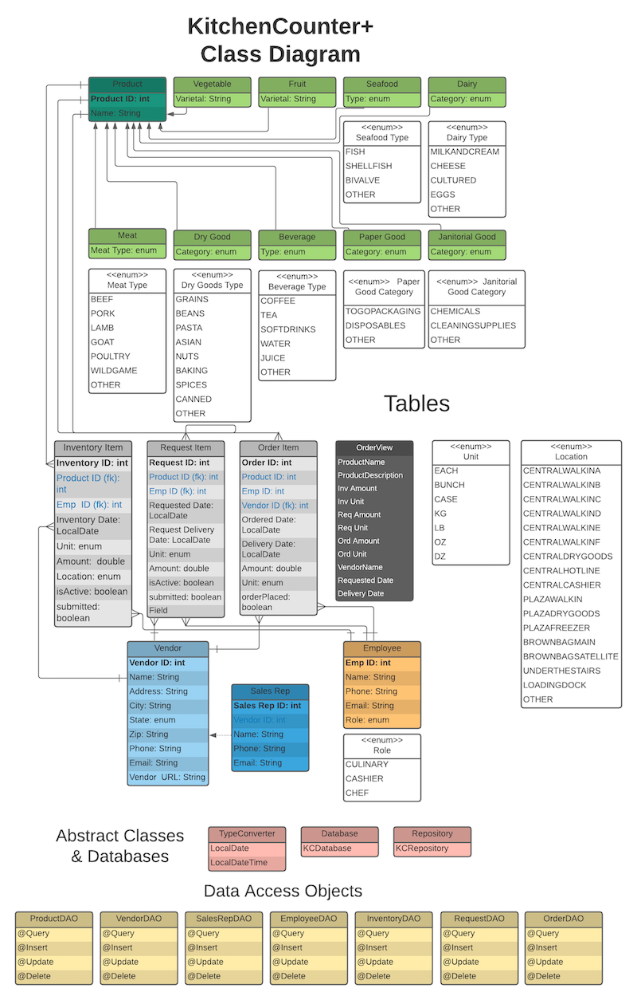
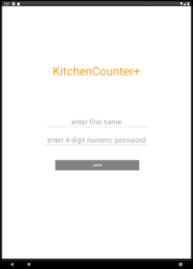
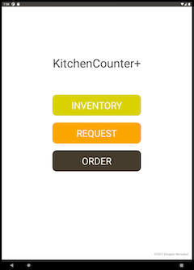
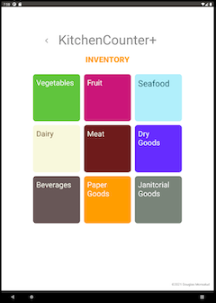
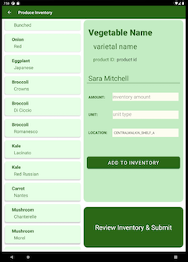
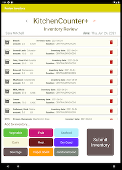
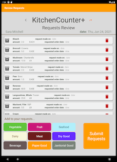
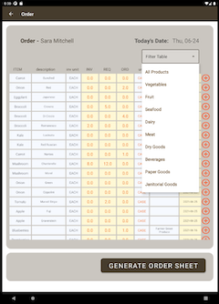
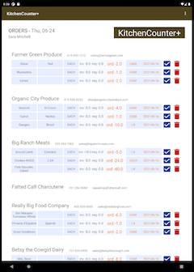
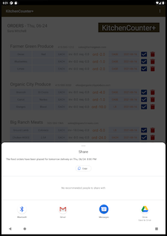

 
# KitchenCounter+
This was a class project at WGU. Although I learned quite a bit during the 
development of this app, I acknowledge that this is spaghetti code at it's most 
delicious and most carbo-loaded. I plan on taking another wack at this after I finish GrooveStock. 

**KitchenCounter+** is team-oriented inventory, request, and order system for food service 
organizations. Using Android tablets, the entire kitchen team can use 
the **KitchenCounter+** software to aggregate and automate the ordering 
process. The software's main principle is that the traditional ordering 
process consists of three parts that answer these three questions: 
"How much do we have?" (INVENTORY), "How much do we need?" (REQUEST), and, 
therefore, "How much do we need to order?" (ORDER). **KitchenCounter+** 
allows each team member to add items to inventory and the requested products 
list. The order section consolidates all of the entries and allows the 
purchasing manager to place orders and communicate the daily orders to the 
team via text or email.

## Build Status
- in progress; started 05/21
- ORDER section is in progress
- the sharing function in the ORDER section is in progress
- I have later plans to move the database to cloud storage; for now the DB is stored on device

## Code Style
This project was coded using the MVC model and the Room Framework. The 
source code is divided into Database, Entities, DAOs, UI (activities & fragments),
and Tables (including Views). The programming language is Java.

## Class Diagram
The structure of this application is in this diagram:

## User Interface
    

There is a simple login page that gives you access to the app. The main UI is divided into 
three sections: INVENTORY, REQUEST, and ORDER. The main screen gives the user a simple choice
of which section they would like to enter. In the INVENTORY and REQUEST sections there is a 
main screen that displays the nine categories of products that can be counted. 

Once the user has entered a product area, they are presented with a scrollable list of product
to count and a detail section in which to add a count to the total. The REQUEST section is
almost identical. Both INVENTORY and REQUEST data entry screens give the user a chance to 
navigate directly to the review section where they have a chance to delete items, go back to a 
product section to add more to inventory, or submit their daily inventory to the ORDER database.

 

After the INVENTORY and REQUEST activities are finished, the purchasing manager can enter the ORDER 
screen to review the numbers. They can add items from this table and, once their order is completed,
they can navigate to an order sheet. Items are now organized by Vendor and can be deleted from this screen 
if needed. The screen keeps track of orders as they are placed and there is a share function that
allows the purchasing manager to alert anyone on the team (e.g. the morning receiver)

  

## Installation
This repository contains the files needed to run the application on Android Studio (emulator or device). There
is no APK. The code is currently configured to erase the database each time you run the application so that 
there is a clean database to work with. There is a small section in the KCDatabse class that can be
commented out for persistent storage.

